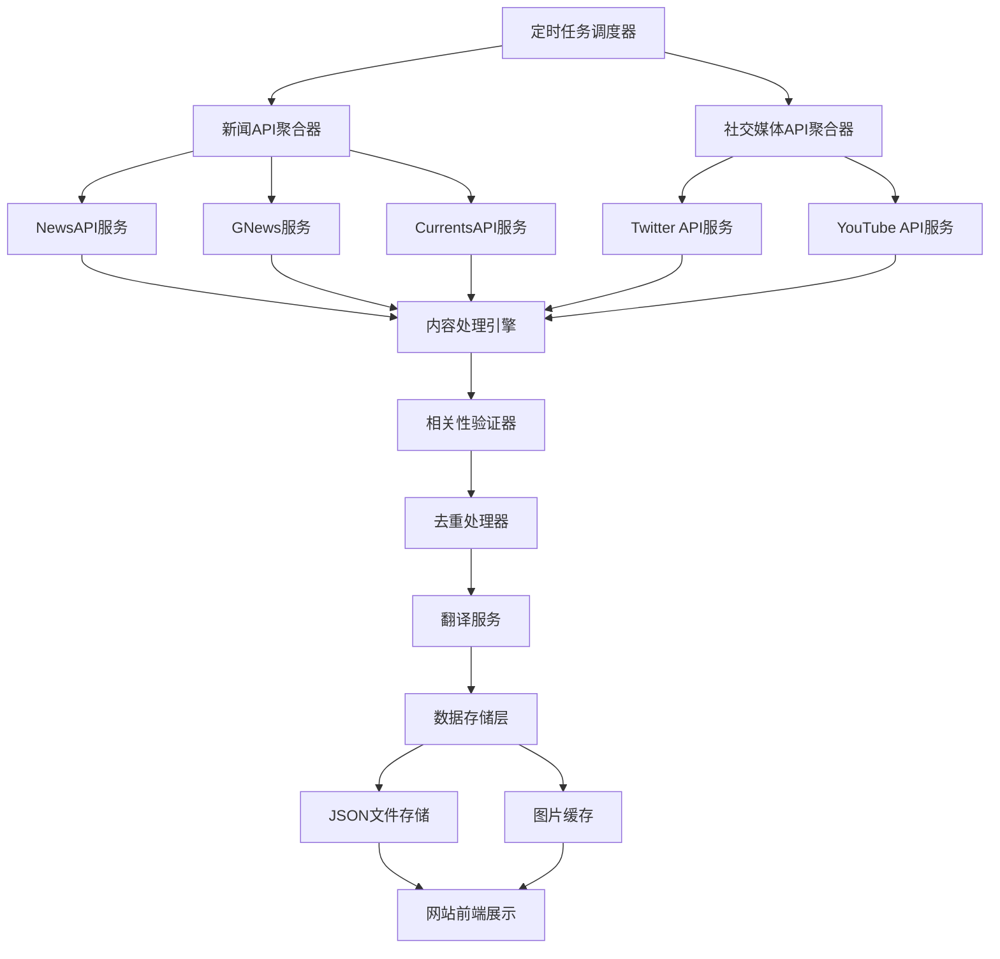

# Yang Hansen真实新闻获取系统 - 设计文档

## 概述

本系统通过集成多个新闻API服务和社交媒体API，自动获取与Yang Hansen相关的真实新闻内容和社交媒体动态，为个人网站提供高质量、及时更新的新闻资讯。

## 系统架构

### 整体架构图



### 核心组件

#### 1. API服务层 (API Service Layer)
- **新闻API聚合器**: 统一管理多个新闻API的调用
- **社交媒体API聚合器**: 管理Twitter、YouTube等社交媒体API
- **API配额管理器**: 监控和管理各API的使用配额

#### 2. 数据处理层 (Data Processing Layer)
- **内容处理引擎**: 统一处理不同来源的数据格式
- **相关性验证器**: 验证内容与Yang Hansen的相关性
- **去重处理器**: 识别和处理重复内容
- **翻译服务**: 提供中英文翻译功能

#### 3. 存储层 (Storage Layer)
- **JSON文件存储**: 存储处理后的新闻数据
- **图片缓存**: 缓存新闻相关图片
- **配置管理**: 存储API密钥和系统配置

#### 4. 调度层 (Scheduler Layer)
- **定时任务调度器**: 管理数据获取的定时任务
- **任务队列**: 处理异步任务和错误重试

## 组件和接口

### API服务接口

#### NewsAPI集成
```typescript
interface NewsAPIService {
  searchNews(query: string, options: SearchOptions): Promise<NewsArticle[]>
  getTopHeadlines(category: string): Promise<NewsArticle[]>
  validateApiKey(): Promise<boolean>
}

interface SearchOptions {
  language?: 'en' | 'zh'
  sortBy?: 'relevancy' | 'popularity' | 'publishedAt'
  pageSize?: number
  from?: string
  to?: string
}
```

#### 社交媒体API接口
```typescript
interface TwitterAPIService {
  searchTweets(query: string, options: TwitterSearchOptions): Promise<Tweet[]>
  getUserTweets(username: string): Promise<Tweet[]>
}

interface YouTubeAPIService {
  searchVideos(query: string, options: YouTubeSearchOptions): Promise<Video[]>
  getVideoDetails(videoId: string): Promise<VideoDetails>
}
```

### 数据模型

#### 统一新闻数据模型
```typescript
interface UnifiedNewsItem {
  id: string
  title: string
  summary: string
  content: string
  url: string
  imageUrl?: string
  publishedAt: string
  source: {
    name: string
    url: string
    type: 'news' | 'social' | 'video'
  }
  language: 'en' | 'zh'
  translation?: {
    title: string
    summary: string
    content: string
  }
  relevanceScore: number
  tags: string[]
  category: NewsCategory
}

type NewsCategory = 
  | 'game_performance'
  | 'training'
  | 'interview'
  | 'achievement'
  | 'social_activity'
  | 'career_development'
```

#### 社交媒体数据模型
```typescript
interface SocialMediaItem {
  id: string
  platform: 'twitter' | 'youtube'
  content: string
  url: string
  author: string
  publishedAt: string
  mediaUrls: string[]
  engagement: {
    likes?: number
    shares?: number
    comments?: number
    views?: number
  }
  relevanceScore: number
}
```

### 内容处理流程

#### 1. 数据获取流程
```typescript
class NewsAggregator {
  async fetchAllNews(): Promise<UnifiedNewsItem[]> {
    const results = await Promise.allSettled([
      this.newsAPIService.searchNews('Yang Hansen'),
      this.gNewsService.searchNews('杨瀚森'),
      this.currentsAPIService.searchNews('Yang Hansen basketball'),
      this.twitterService.searchTweets('Yang Hansen'),
      this.youtubeService.searchVideos('Yang Hansen basketball')
    ])
    
    return this.processResults(results)
  }
  
  private processResults(results: PromiseSettledResult<any>[]): UnifiedNewsItem[] {
    // 处理API结果，统一数据格式
    // 过滤失败的请求
    // 合并所有数据源
  }
}
```

#### 2. 相关性验证算法
```typescript
class RelevanceValidator {
  calculateRelevanceScore(item: UnifiedNewsItem): number {
    let score = 0
    
    // 标题相关性 (40%)
    score += this.analyzeTitle(item.title) * 0.4
    
    // 内容相关性 (35%)
    score += this.analyzeContent(item.content) * 0.35
    
    // 来源权威性 (15%)
    score += this.analyzeSource(item.source) * 0.15
    
    // 时效性 (10%)
    score += this.analyzeTimeliness(item.publishedAt) * 0.1
    
    return Math.min(score, 1.0)
  }
  
  private analyzeTitle(title: string): number {
    const keywords = ['Yang Hansen', '杨瀚森', 'Hansen Yang']
    const basketballTerms = ['basketball', 'NBA', 'CBA', '篮球']
    
    // 关键词匹配算法
    // 返回0-1之间的相关性分数
  }
}
```

#### 3. 去重处理算法
```typescript
class DuplicationRemover {
  removeDuplicates(items: UnifiedNewsItem[]): UnifiedNewsItem[] {
    const uniqueItems: UnifiedNewsItem[] = []
    const seenHashes = new Set<string>()
    
    for (const item of items) {
      const contentHash = this.generateContentHash(item)
      const similarityScore = this.findMostSimilar(item, uniqueItems)
      
      if (!seenHashes.has(contentHash) && similarityScore < 0.8) {
        uniqueItems.push(item)
        seenHashes.add(contentHash)
      }
    }
    
    return uniqueItems
  }
  
  private generateContentHash(item: UnifiedNewsItem): string {
    // 基于标题和内容生成哈希值
    return crypto.createHash('md5')
      .update(item.title + item.summary)
      .digest('hex')
  }
}
```

## 数据模型

### 数据库设计 (JSON文件结构)

#### news.json 结构
```json
{
  "lastUpdated": "2024-01-20T10:00:00Z",
  "featured": {
    "id": "news_001",
    "title": "Yang Hansen Leads Team to Championship Victory",
    "summary": "19-year-old center Yang Hansen dominated the court...",
    "content": "Full article content...",
    "url": "https://example.com/news/yang-hansen-championship",
    "imageUrl": "https://example.com/images/yang-hansen-victory.jpg",
    "publishedAt": "2024-01-20T08:00:00Z",
    "source": {
      "name": "ESPN",
      "url": "https://espn.com",
      "type": "news"
    },
    "language": "en",
    "translation": {
      "title": "杨瀚森带领球队夺得冠军",
      "summary": "19岁的中锋杨瀚森在球场上表现出色...",
      "content": "完整文章内容..."
    },
    "relevanceScore": 0.95,
    "tags": ["championship", "basketball", "victory"],
    "category": "achievement"
  },
  "articles": [
    // 更多新闻文章...
  ],
  "socialMedia": [
    {
      "id": "social_001",
      "platform": "twitter",
      "content": "Amazing performance by Yang Hansen tonight! 🏀",
      "url": "https://twitter.com/user/status/123456789",
      "author": "Basketball Fan",
      "publishedAt": "2024-01-20T09:30:00Z",
      "mediaUrls": ["https://pbs.twimg.com/media/image.jpg"],
      "engagement": {
        "likes": 245,
        "shares": 67,
        "comments": 23
      },
      "relevanceScore": 0.87
    }
  ],
  "trending": ["Yang Hansen", "basketball", "championship", "China", "NBA prospect"]
}
```

#### media.json 更新结构
```json
{
  "lastUpdated": "2024-01-20T10:00:00Z",
  "videos": [
    {
      "id": "video_001",
      "title": "Yang Hansen Championship Game Highlights",
      "description": "Best moments from Yang Hansen's championship performance",
      "thumbnail": "https://img.youtube.com/vi/VIDEO_ID/maxresdefault.jpg",
      "url": "https://youtube.com/watch?v=VIDEO_ID",
      "duration": "5:32",
      "publishedAt": "2024-01-20T07:00:00Z",
      "views": "125K",
      "source": "YouTube",
      "category": "highlights",
      "relevanceScore": 0.92
    }
  ],
  "photos": [
    // 现有照片数据保持不变
  ]
}
```

## 错误处理

### API错误处理策略

#### 1. 网络错误处理
```typescript
class APIErrorHandler {
  async handleAPICall<T>(
    apiCall: () => Promise<T>,
    retryOptions: RetryOptions = { maxRetries: 3, delay: 1000 }
  ): Promise<T | null> {
    for (let attempt = 1; attempt <= retryOptions.maxRetries; attempt++) {
      try {
        return await apiCall()
      } catch (error) {
        if (attempt === retryOptions.maxRetries) {
          this.logError('API call failed after all retries', error)
          return null
        }
        
        await this.delay(retryOptions.delay * attempt)
      }
    }
    return null
  }
}
```

#### 2. API配额管理
```typescript
class APIQuotaManager {
  private quotas = new Map<string, QuotaInfo>()
  
  async checkQuota(apiName: string): Promise<boolean> {
    const quota = this.quotas.get(apiName)
    if (!quota) return true
    
    const now = Date.now()
    if (now - quota.resetTime > quota.resetInterval) {
      quota.used = 0
      quota.resetTime = now
    }
    
    return quota.used < quota.limit
  }
  
  recordUsage(apiName: string, count: number = 1): void {
    const quota = this.quotas.get(apiName)
    if (quota) {
      quota.used += count
    }
  }
}
```

### 数据质量保证

#### 1. 内容验证
```typescript
class ContentValidator {
  validateNewsItem(item: UnifiedNewsItem): ValidationResult {
    const errors: string[] = []
    
    if (!item.title || item.title.length < 10) {
      errors.push('Title too short or missing')
    }
    
    if (!item.content || item.content.length < 100) {
      errors.push('Content too short or missing')
    }
    
    if (item.relevanceScore < 0.5) {
      errors.push('Low relevance score')
    }
    
    return {
      isValid: errors.length === 0,
      errors
    }
  }
}
```

## 测试策略

### 单元测试
- API服务类的测试
- 数据处理算法的测试
- 相关性验证算法的测试
- 去重算法的测试

### 集成测试
- API集成测试（使用mock数据）
- 端到端数据流测试
- 错误处理流程测试

### 性能测试
- API响应时间测试
- 大量数据处理性能测试
- 内存使用情况监控

## 部署和运维

### 环境配置
```typescript
interface SystemConfig {
  apis: {
    newsAPI: {
      key: string
      baseUrl: string
      rateLimit: number
    }
    gNews: {
      key: string
      baseUrl: string
      rateLimit: number
    }
    twitter: {
      bearerToken: string
      baseUrl: string
      rateLimit: number
    }
    youtube: {
      key: string
      baseUrl: string
      rateLimit: number
    }
  }
  scheduler: {
    newsUpdateInterval: number // 4 hours
    socialUpdateInterval: number // 2 hours
  }
  storage: {
    dataPath: string
    backupPath: string
    maxFileSize: number
  }
}
```

### 监控和日志
- API调用成功率监控
- 数据获取量统计
- 错误日志记录
- 性能指标监控

### 备份策略
- 每日自动备份新闻数据
- 配置文件版本控制
- 错误恢复机制