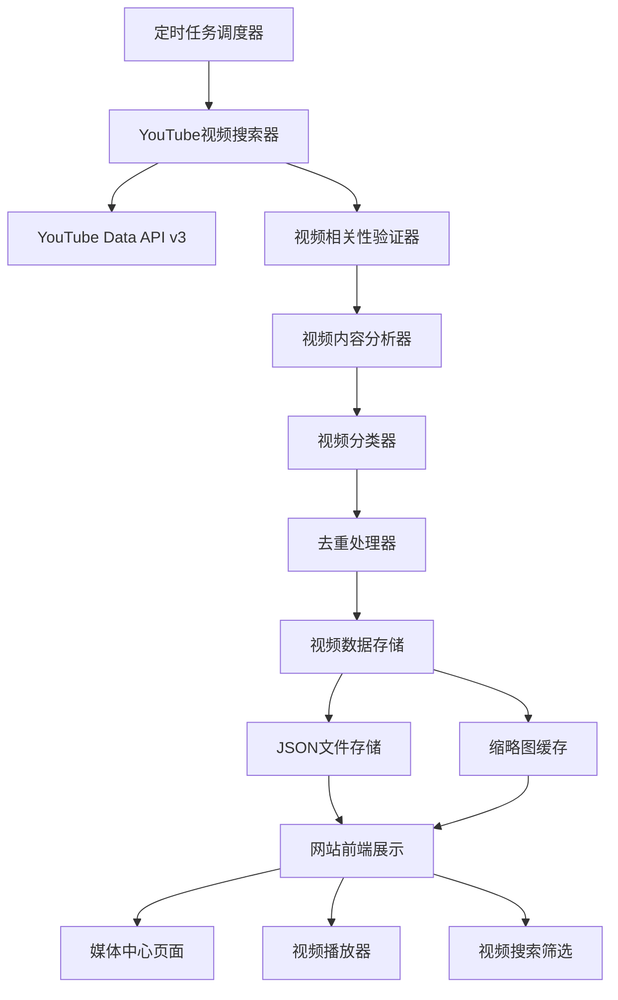

# YouTube视频集成系统 - 设计文档

## 概述

本系统通过集成YouTube Data API v3，为杨瀚森个人网站提供自动化的视频内容获取、处理和展示功能。系统采用模块化设计，与现有新闻系统架构保持一致，确保易于维护和扩展。

## 系统架构

### 整体架构图



### 核心组件

#### 1. YouTube API服务层
- **YouTubeAPIService**: 封装YouTube Data API v3调用
- **APIQuotaManager**: 管理API配额和限流
- **ErrorHandler**: 处理API错误和重试机制

#### 2. 视频处理层
- **VideoSearchEngine**: 多策略视频搜索引擎
- **VideoRelevanceValidator**: 视频相关性验证器
- **VideoClassifier**: 视频自动分类器
- **VideoDuplicateRemover**: 视频去重处理器

#### 3. 数据管理层
- **VideoDataManager**: 视频数据管理器
- **ThumbnailCache**: 缩略图缓存管理
- **VideoMetadataProcessor**: 视频元数据处理器

#### 4. 前端展示层
- **VideoGallery**: 视频画廊组件
- **VideoPlayer**: 嵌入式播放器组件
- **VideoFilter**: 视频筛选和搜索组件

## 组件和接口

### YouTube API服务接口

#### YouTubeAPIService
```typescript
interface YouTubeAPIService {
  searchVideos(query: string, options: SearchOptions): Promise<VideoSearchResult>
  getVideoDetails(videoIds: string[]): Promise<VideoDetails[]>
  getChannelVideos(channelId: string, options: ChannelOptions): Promise<VideoSearchResult>
  validateApiKey(): Promise<boolean>
}

interface SearchOptions {
  maxResults?: number
  order?: 'relevance' | 'date' | 'viewCount' | 'rating'
  publishedAfter?: string
  publishedBefore?: string
  videoDuration?: 'short' | 'medium' | 'long'
  videoDefinition?: 'high' | 'standard'
  regionCode?: string
  relevanceLanguage?: string
}

interface VideoSearchResult {
  items: YouTubeVideo[]
  nextPageToken?: string
  totalResults: number
  resultsPerPage: number
}
```

#### 视频数据模型
```typescript
interface YouTubeVideo {
  id: string
  title: string
  description: string
  thumbnails: {
    default: ThumbnailInfo
    medium: ThumbnailInfo
    high: ThumbnailInfo
    standard?: ThumbnailInfo
    maxres?: ThumbnailInfo
  }
  publishedAt: string
  channelId: string
  channelTitle: string
  duration: string
  viewCount: number
  likeCount: number
  commentCount: number
  tags: string[]
  categoryId: string
  liveBroadcastContent: string
  defaultLanguage?: string
  defaultAudioLanguage?: string
}

interface ThumbnailInfo {
  url: string
  width: number
  height: number
}
```

### 视频处理接口

#### VideoSearchEngine
```typescript
class VideoSearchEngine {
  private searchStrategies = [
    {
      name: 'primary',
      query: 'Yang Hansen basketball',
      weight: 1.0,
      options: { order: 'relevance', maxResults: 25 }
    },
    {
      name: 'nba_draft',
      query: 'Yang Hansen NBA draft 2024',
      weight: 0.9,
      options: { order: 'date', maxResults: 20 }
    },
    {
      name: 'blazers',
      query: 'Yang Hansen Portland Blazers',
      weight: 0.9,
      options: { order: 'relevance', maxResults: 20 }
    },
    {
      name: 'summer_league',
      query: 'Yang Hansen Summer League highlights',
      weight: 0.8,
      options: { order: 'viewCount', maxResults: 15 }
    },
    {
      name: 'chinese_jokic',
      query: '"Chinese Jokic" Yang Hansen',
      weight: 0.8,
      options: { order: 'relevance', maxResults: 15 }
    },
    {
      name: 'chinese_keywords',
      query: '杨瀚森 篮球',
      weight: 0.7,
      options: { order: 'date', maxResults: 10 }
    }
  ]

  async searchWithMultipleStrategies(options: MultiSearchOptions): Promise<SearchResult>
  async searchByCategory(category: VideoCategory): Promise<CategorySearchResult>
  async searchLatestVideos(count: number): Promise<VideoSearchResult>
}

type VideoCategory = 
  | 'highlights'
  | 'training'
  | 'interview'
  | 'news'
  | 'draft'
  | 'summer_league'
  | 'skills'
```

#### VideoRelevanceValidator
```typescript
class VideoRelevanceValidator {
  calculateRelevanceScore(video: YouTubeVideo): number {
    let score = 0
    
    // 标题相关性 (40%)
    score += this.analyzeTitleRelevance(video.title) * 0.4
    
    // 描述相关性 (25%)
    score += this.analyzeDescriptionRelevance(video.description) * 0.25
    
    // 频道权威性 (20%)
    score += this.analyzeChannelAuthority(video.channelTitle) * 0.2
    
    // 视频质量指标 (15%)
    score += this.analyzeVideoQuality(video) * 0.15
    
    return Math.min(score, 1.0)
  }

  private analyzeTitleRelevance(title: string): number {
    const keywords = [
      { term: 'Yang Hansen', weight: 1.0 },
      { term: '杨瀚森', weight: 1.0 },
      { term: 'Hansen Yang', weight: 0.9 },
      { term: 'Chinese Jokic', weight: 0.8 },
      { term: 'Portland Blazers', weight: 0.7 },
      { term: 'NBA Draft', weight: 0.6 },
      { term: 'Summer League', weight: 0.6 }
    ]
    
    // 关键词匹配算法实现
    return this.calculateKeywordScore(title, keywords)
  }
}
```

### 视频分类系统

#### VideoClassifier
```typescript
class VideoClassifier {
  classifyVideo(video: YouTubeVideo): VideoClassification {
    const classification = {
      category: this.determineCategory(video),
      tags: this.generateTags(video),
      priority: this.calculatePriority(video),
      quality: this.assessQuality(video)
    }
    
    return classification
  }

  private determineCategory(video: YouTubeVideo): VideoCategory {
    const title = video.title.toLowerCase()
    const description = video.description.toLowerCase()
    
    if (this.containsKeywords(title, ['highlight', 'best', 'top plays'])) {
      return 'highlights'
    }
    if (this.containsKeywords(title, ['training', 'workout', 'practice'])) {
      return 'training'
    }
    if (this.containsKeywords(title, ['interview', 'talk', 'speaks'])) {
      return 'interview'
    }
    if (this.containsKeywords(title, ['draft', 'selected', 'pick'])) {
      return 'draft'
    }
    if (this.containsKeywords(title, ['summer league', 'vegas'])) {
      return 'summer_league'
    }
    
    return 'news' // 默认分类
  }

  private generateTags(video: YouTubeVideo): string[] {
    const tags = new Set<string>()
    
    // 基础标签
    tags.add('Yang Hansen')
    tags.add('basketball')
    
    // 基于内容的标签
    if (video.title.includes('NBA')) tags.add('NBA')
    if (video.title.includes('Blazers')) tags.add('Portland Blazers')
    if (video.title.includes('center')) tags.add('center')
    if (video.title.includes('China')) tags.add('China')
    
    return Array.from(tags)
  }
}
```

## 数据模型

### 统一视频数据模型
```typescript
interface UnifiedVideoItem {
  id: string
  youtubeId: string
  title: string
  description: string
  thumbnail: string
  duration: string
  publishedAt: string
  viewCount: number
  likeCount: number
  channelTitle: string
  channelId: string
  category: VideoCategory
  tags: string[]
  relevanceScore: number
  quality: VideoQuality
  embedUrl: string
  watchUrl: string
  isProcessed: boolean
  lastUpdated: string
}

interface VideoQuality {
  score: number // 0-1
  factors: {
    resolution: 'low' | 'medium' | 'high' | 'hd'
    duration: 'appropriate' | 'too_short' | 'too_long'
    engagement: 'low' | 'medium' | 'high'
    recency: 'recent' | 'moderate' | 'old'
  }
}
```

### 数据存储结构

#### videos.json 结构
```json
{
  "lastUpdated": "2024-01-20T10:00:00Z",
  "featured": {
    "id": "video_001",
    "youtubeId": "dQw4w9WgXcQ",
    "title": "Yang Hansen Championship Game Highlights",
    "description": "Best moments from Yang Hansen's championship performance",
    "thumbnail": "https://img.youtube.com/vi/dQw4w9WgXcQ/maxresdefault.jpg",
    "duration": "PT5M32S",
    "publishedAt": "2024-01-20T07:00:00Z",
    "viewCount": 125000,
    "likeCount": 8500,
    "channelTitle": "NBA Official",
    "channelId": "UCWJ2lWNubArHWmf3FIHbfcQ",
    "category": "highlights",
    "tags": ["Yang Hansen", "basketball", "NBA", "highlights"],
    "relevanceScore": 0.95,
    "quality": {
      "score": 0.9,
      "factors": {
        "resolution": "hd",
        "duration": "appropriate",
        "engagement": "high",
        "recency": "recent"
      }
    },
    "embedUrl": "https://www.youtube.com/embed/dQw4w9WgXcQ",
    "watchUrl": "https://www.youtube.com/watch?v=dQw4w9WgXcQ",
    "isProcessed": true,
    "lastUpdated": "2024-01-20T10:00:00Z"
  },
  "categories": {
    "highlights": [
      // 比赛集锦视频列表
    ],
    "training": [
      // 训练视频列表
    ],
    "interview": [
      // 采访视频列表
    ],
    "news": [
      // 新闻报道视频列表
    ],
    "draft": [
      // 选秀相关视频列表
    ],
    "summer_league": [
      // 夏季联赛视频列表
    ]
  },
  "statistics": {
    "total": 45,
    "byCategory": {
      "highlights": 15,
      "training": 8,
      "interview": 6,
      "news": 10,
      "draft": 4,
      "summer_league": 2
    },
    "averageRelevance": 0.78,
    "averageQuality": 0.82,
    "totalViews": 2500000,
    "timeRange": {
      "oldest": "2024-01-01T00:00:00Z",
      "newest": "2024-01-20T10:00:00Z"
    },
    "lastProcessed": "2024-01-20T10:00:00Z"
  }
}
```

## 错误处理

### API错误处理策略

#### 1. 配额管理
```typescript
class YouTubeQuotaManager {
  private dailyQuota = 10000 // YouTube API免费配额
  private usedQuota = 0
  private resetTime = new Date()

  checkQuota(requestCost: number): boolean {
    if (this.isNewDay()) {
      this.resetQuota()
    }
    
    return (this.usedQuota + requestCost) <= this.dailyQuota
  }

  recordUsage(requestCost: number): void {
    this.usedQuota += requestCost
    this.saveQuotaState()
  }

  private getRequestCost(operation: string): number {
    const costs = {
      'search': 100,
      'videos': 1,
      'channels': 1
    }
    return costs[operation] || 1
  }
}
```

#### 2. 错误重试机制
```typescript
class YouTubeErrorHandler {
  async handleAPICall<T>(
    apiCall: () => Promise<T>,
    retryOptions: RetryOptions = { maxRetries: 3, delay: 1000 }
  ): Promise<T | null> {
    for (let attempt = 1; attempt <= retryOptions.maxRetries; attempt++) {
      try {
        return await apiCall()
      } catch (error) {
        if (this.isRetryableError(error) && attempt < retryOptions.maxRetries) {
          await this.delay(retryOptions.delay * Math.pow(2, attempt - 1))
          continue
        }
        
        this.logError('YouTube API call failed', error, attempt)
        return null
      }
    }
    return null
  }

  private isRetryableError(error: any): boolean {
    const retryableErrors = [
      'quotaExceeded',
      'rateLimitExceeded',
      'backendError',
      'internalServerError'
    ]
    
    return retryableErrors.includes(error.code) || error.status >= 500
  }
}
```

## 测试策略

### 单元测试
- YouTubeAPIService的API调用测试
- VideoRelevanceValidator的相关性算法测试
- VideoClassifier的分类准确性测试
- VideoDuplicateRemover的去重逻辑测试

### 集成测试
- YouTube API集成测试（使用mock数据）
- 端到端视频获取流程测试
- 数据存储和检索测试
- 前端组件集成测试

### 性能测试
- API响应时间测试
- 大量视频数据处理性能测试
- 前端视频列表渲染性能测试
- 缩略图加载优化测试

## 部署和运维

### 环境配置
```typescript
interface YouTubeSystemConfig {
  api: {
    key: string
    baseUrl: string
    version: string
    quotaLimit: number
  }
  search: {
    defaultMaxResults: number
    relevanceThreshold: number
    qualityThreshold: number
    updateInterval: number // 小时
  }
  storage: {
    dataPath: string
    thumbnailCachePath: string
    backupPath: string
    maxCacheSize: number // MB
  }
  frontend: {
    videosPerPage: number
    autoplayEnabled: boolean
    thumbnailQuality: 'default' | 'medium' | 'high'
  }
}
```

### 监控和日志
- YouTube API调用成功率和响应时间监控
- 视频获取量和质量统计
- 用户视频观看行为分析
- 系统错误和异常日志记录

### 缓存策略
- 视频元数据缓存（24小时）
- 缩略图本地缓存
- API响应缓存（1小时）
- 前端组件状态缓存

这个设计文档涵盖了YouTube视频集成系统的完整架构和实现细节。设计采用了与现有新闻系统相似的模块化架构，确保了系统的一致性和可维护性。

请您审查这个设计文档，确认是否满足您的期望和需求。如果设计方案符合要求，我将继续创建详细的实施任务列表。